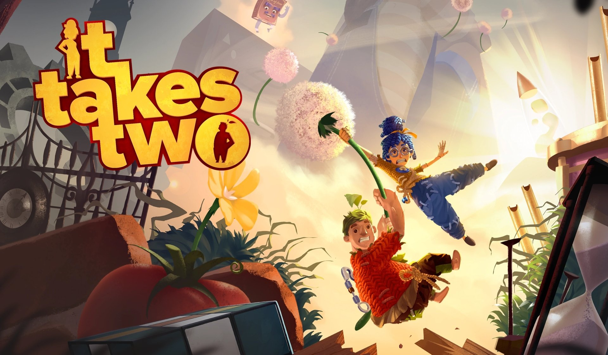
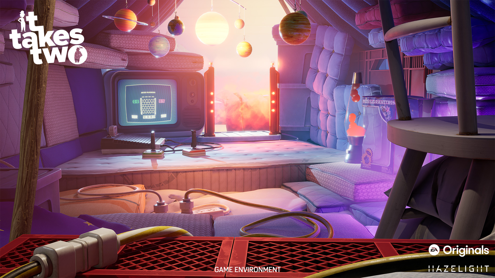
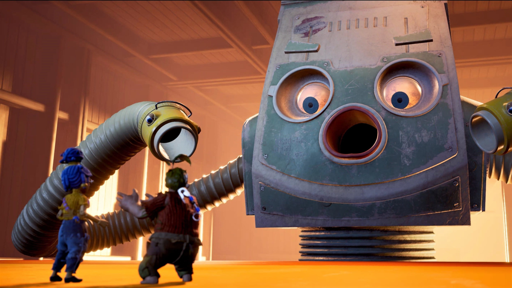

# It Takes Two: Game Design Document
Assignment 2: Game Design Document

## About:
**"It Takes Two"** is a cooperative adventure game where a separating couple was mysteriously cursed and turned into a doll. There's only one way to get out - to explore and collaborate in a series of adventures, together! 

## Core loop:

[It Takes Two - Core Loop.drawio](It%20Takes%20Two%20-%20Core%20Loop.drawio)

## Pillars: 
> Split-screen Co-op

> Story Rich

> Action-Adventure

> Atmospheric

Image sources:
https://wall.alphacoders.com/big.php?i=1148443
https://xboxwire.thesourcemediaassets.com/sites/2/2020/06/ITT_1920x1080_Promo_02.jpg
https://images7.alphacoders.com/114/1148437.jpg_